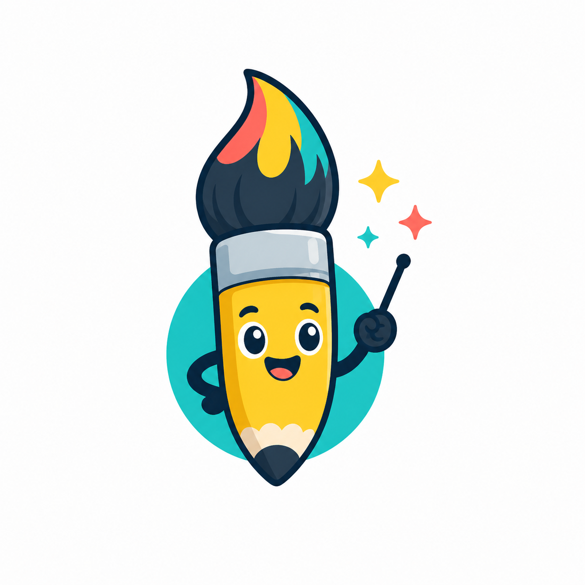

# Risovalka

  

Risovalka - дружелюбный Python-инструментарий для обучения программированию
через небольшие 2D-игры, рисунки, анимации и интерактивные эксперименты.

Проект подходит для занятий в классе, кружков, мастер-классов и самостоятельной
практики. Ученики быстро видят результат: фигуру на экране, движущегося
персонажа, реакцию на нажатие клавиши, маленькую игру, которая шаг за шагом
становится игровой.

## Зачем Нужен Этот Проект

Во многих вводных курсах программирования слишком много времени уходит на
абстрактные примеры до того, как ученик успевает собрать что-то понятное и
живое. Risovalka начинает с визуальной обратной связи и игровых заданий, а уже
через них знакомит с настоящими идеями Python в понятном контексте.

Цель проекта - сделать программирование практичным с первых занятий:

- рисовать с помощью кода
- оживлять объекты
- реагировать на клавиатуру и мышь
- создавать простые игровые правила
- организовывать проекты в понятные файлы
- постепенно осваивать привычки, которые пригодятся за пределами учебных задач

## Для Кого

Risovalka создается для:

- преподавателей, которые готовят занятия по Python и игровому программированию
- учеников, создающих свои первые интерактивные программы
- родителей и наставников, которым нужны доступные материалы для обучения
- кружков, лагерей и мастер-классов, где важна практичная структура проектов

## Что Можно Создавать

Проект ориентирован на творческое программирование для начинающих:

- мини-игры в аркадном стиле
- анимированные сцены
- эксперименты с рисованием
- демонстрации для занятий
- переиспользуемые примеры для уроков и презентаций

## Текущий Статус

Сейчас это ранняя версия материалов курса и будущего инструментария. Публичный
README будет расширяться по мере того, как проект станет проще устанавливать,
запускать и использовать в обучении.

Пока в репозитории заложена основа структуры курса, вспомогательных материалов
и первых частей Python-пакета.
