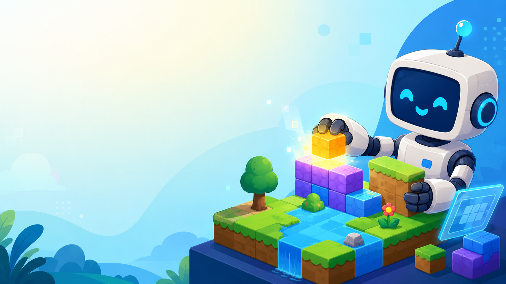
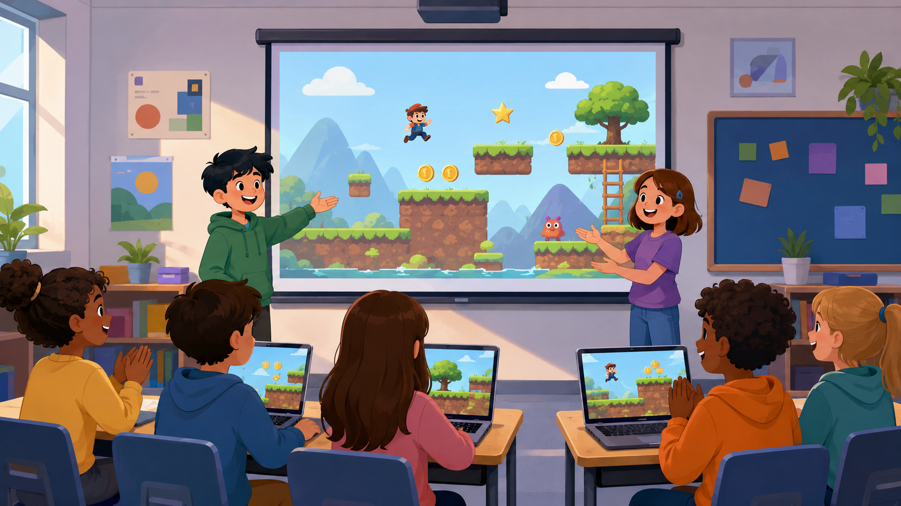
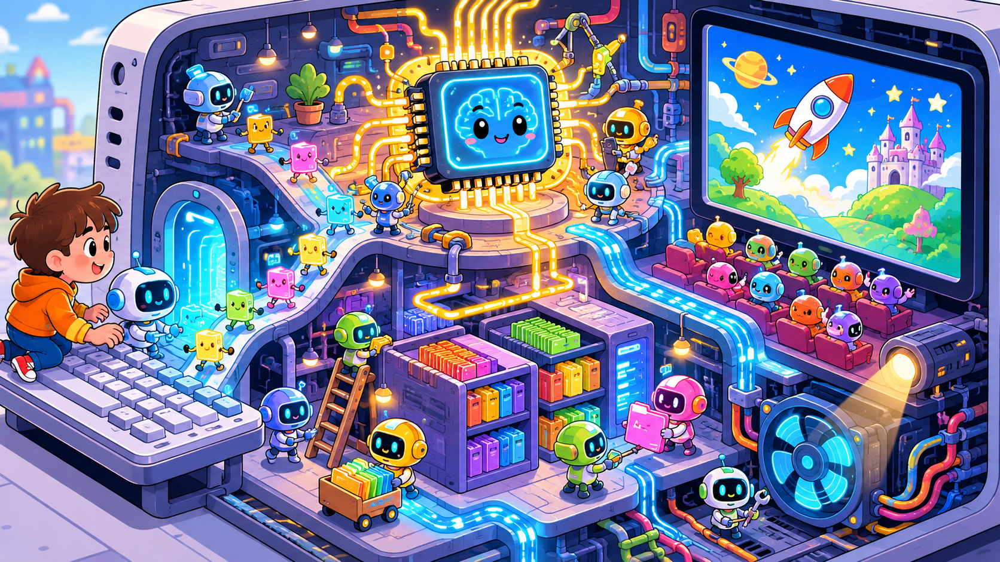
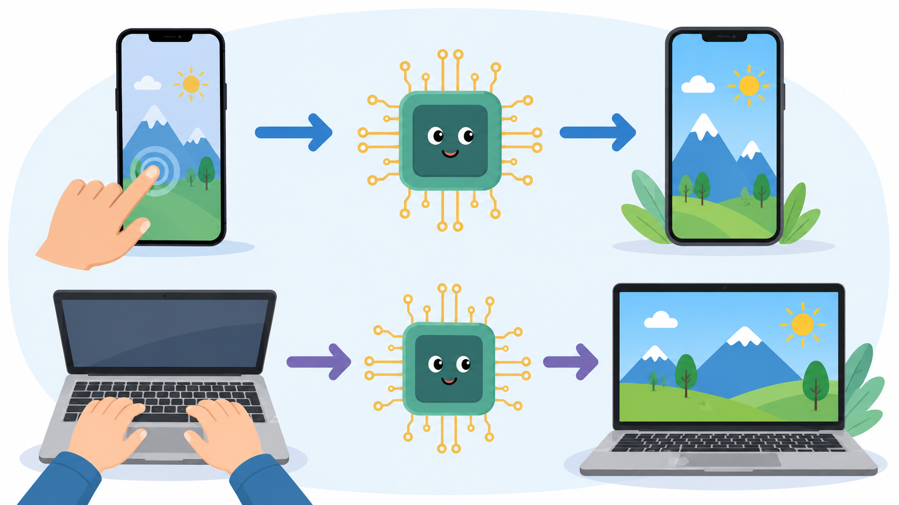
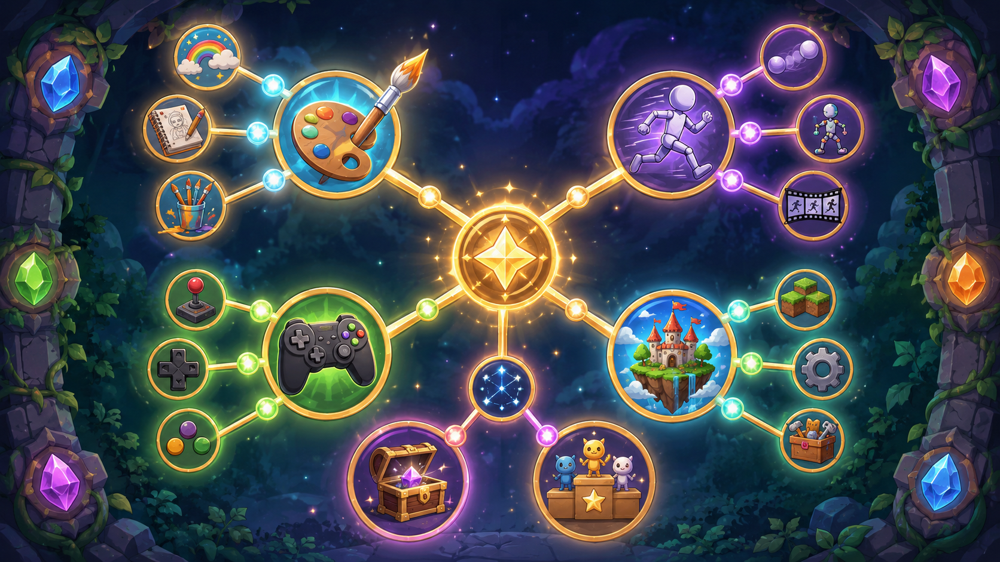

<!-- _class: lead -->

# Основы программирования игр

## Зачем вообще учиться программировать?

---

# Сегодня без кода

Мы поймём:

- что делает компьютер;
- зачем нужны языки программирования;
- почему игры — хороший способ учиться;
- почему AI-агенты не отменяют программирование.

---

# Главная цель курса

> Сделать свою игру и показать другим.

---

# Программирование — это не «магия»

Это способ сказать компьютеру:

**что сделать → в каком порядке → при каких условиях**

---

# Компьютер как город внутри устройства

---

# Компьютер очень быстрый

Но он не догадывается.

Он выполняет инструкции **буквально**.

---

# Бытовая метафора

Рецепт пирога:

1. Возьми миску.
2. Насыпь муку.
3. Добавь яйцо.
4. Перемешай.
5. Поставь в духовку.

Компьютер тоже любит пошаговые рецепты.

---

# Что будет, если пропустить шаг?

Пирог может не получиться.

Программа тоже.

И это не провал — это подсказка.

---

# Язык программирования

Это язык, на котором человек пишет понятные инструкции,
а компьютер может их выполнить.

---

# Почему языков много?

Потому что задачи разные:

- игры;
- сайты;
- роботы;
- смартфоны;
- серверы;
- AI;
- графика.

---

# Почему начинаем с Python?

Потому что он хорошо подходит для первого опыта:

- читаемый;
- быстрый старт;
- много готовых библиотек;
- можно быстро увидеть результат.

---

# Устройство игры

Ввод → компьютер думает → результат на экране

---

# Смартфон — тоже компьютер

Тап по экрану — ввод.

Процессор считает.

Экран показывает результат.

---

# Игра — это разговор

Игрок делает действие.

Компьютер проверяет правила.

Экран меняется.

---

# Эра AI-агентов уже началась

AI всё лучше пишет код.

Но человеку всё равно нужно понимать программирование.

---

# Почему?

AI — как очень быстрый помощник.

Но помощнику нужно правильно объяснить задачу.

---

# Метафора

Людям больше не нужно ходить пешком или скакать на лошади,
когда есть автомобили.

Но навык **вождения** всё равно нужен.

---

# Программирование в эпоху AI

Это навык:

- поставить задачу;
- понять результат;
- заметить ошибку;
- направить агента;
- собрать своё решение.

---

# Что мы будем делать

Не «учить Python ради Python».

Мы будем создавать игры:

- рисовать мир;
- оживлять его;
- управлять героем;
- добавлять врагов;
- показывать финальный проект.

---

# Путь героя

Графика → движение → управление → правила → своя игра

---

# Самая важная фраза курса

> Я смог сделать сам. Смотрите!

---

# Следующий шаг

Открываем VS Code.

Создаём первое окно игры.
