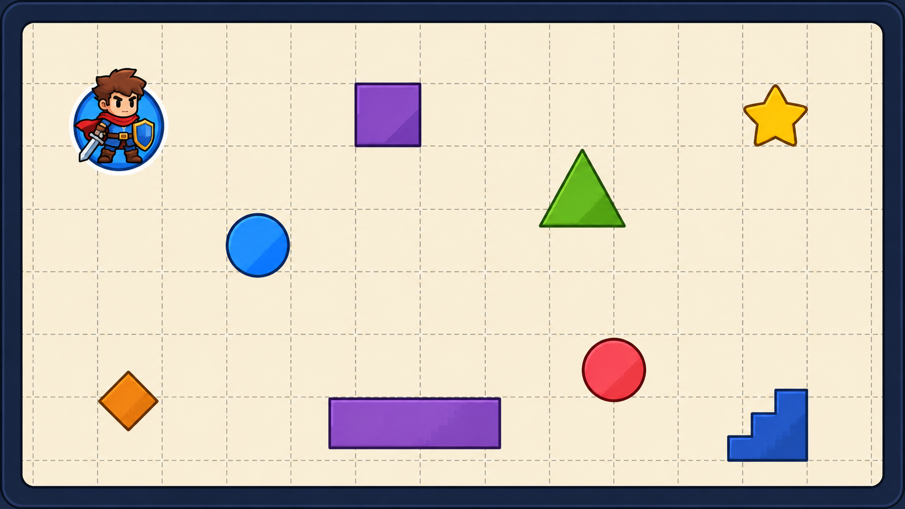
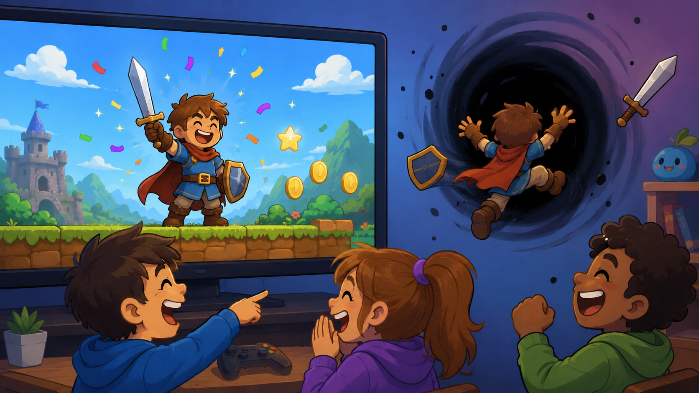
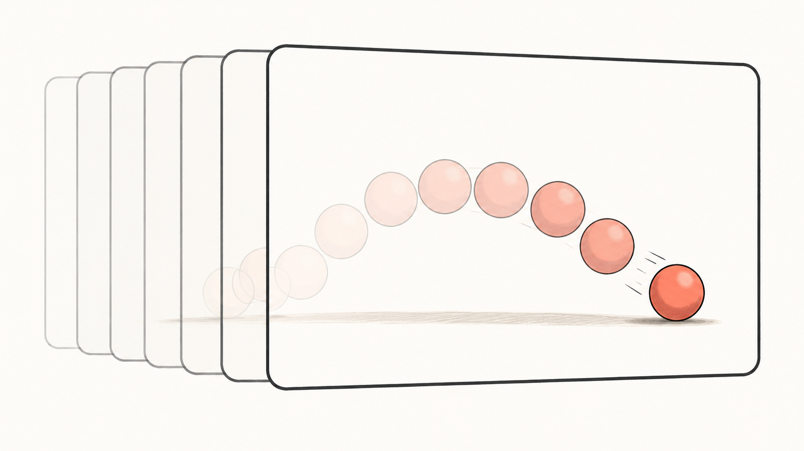

# Сессия 1

## Разбираемся с графикой



---

# Сегодня результат

К концу занятия у вас будет:

- окно игры;
- фон;
- фигуры;
- картинки;
- маленькая анимация;
- своя игровая сцена.

---

# Игра начинается с экрана

Экран — это сцена.

Мы решаем, что на ней появится.

---

# Один кадр игры

1. Очистить экран.
2. Нарисовать объекты.
3. Показать результат.

---

# Почему порядок важен?

Компьютер делает команды строго по очереди.

Если очистить экран после рисования — объект исчезнет.

---



# Баг дня

«Я нарисовал героя, но он пропал!»

---

# Координаты

Координаты отвечают на вопрос:

> Где находится объект?

---

# Экран как тетрадь в клетку

`x` — вправо.

`y` — вниз.

Левый верхний угол — начало.

---

# Фигуры

Сначала можно рисовать простыми формами:

- круг;
- прямоугольник;
- линия;
- текст.

---

# Цвета

Цвет можно выбрать по имени.

Дополнительно: RGB и HEX — точный рецепт цвета.

---

# Ассеты

Ассет — файл, который игра использует:

- картинка;
- фон;
- персонаж;
- предмет;
- звук.

---

# Псевдокод сцены

```text
создай окно
очисти экран цветом неба
нарисуй землю
нарисуй героя
нарисуй монету
покажи кадр
```

---

# Ручная анимация

Анимация — это несколько картинок подряд.



---

# Первый мультфильм

```text
очистить
нарисовать мяч слева
подождать

очистить
нарисовать мяч в центре
подождать

очистить
нарисовать мяч справа
подождать
```

---

# Что будет без очистки?

Объект оставит след.

Иногда это баг.

Иногда это эффект.

---

# Секретные приёмы дня

Для быстрых команд:

- прозрачность;
- вращение;
- RGB-цвет;
- замощение фоном;
- огонь или свечение.

---

# Практика

Соберите свою первую игровую сцену.

Тема на выбор:

- космос;
- замок;
- завод роботов;
- гонка;
- мемная школа.

---

# Базовые достижения

- окно открывается;
- есть фон;
- есть 3 фигуры;
- есть картинка;
- есть текст;
- есть маленькая анимация.

---

# Творческие достижения

- красивая сцена;
- 10+ объектов;
- секретный предмет;
- свой цвет;
- свой ассет;
- смешной баг превращён в эффект.

---

# В конце занятия

Покажите сцену другой команде.

Скажите:

> Что мы сделали сами?
