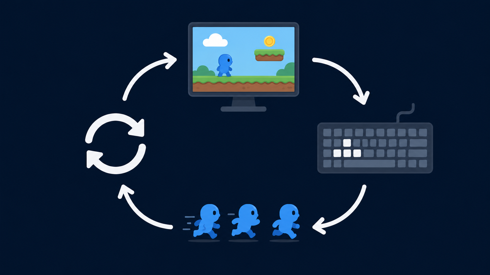

# Сессия 2

## Игровой цикл и ввод



---

# Сегодня результат

К концу занятия герой будет:

- двигаться;
- реагировать на клавиатуру;
- сталкиваться со стенами;
- возможно — реагировать на мышь;
- возможно — управляться двумя игроками.

---

# Проблема

В прошлый раз мы могли рисовать кадры руками.

Но игра не может состоять из тысячи вручную написанных кадров.

---

# Нужен цикл

Цикл — это повторение.

Пример из жизни:

> Пока играет музыка — танцуем.

---

# Игровой цикл

Пока игра открыта:

1. проверить ввод;
2. изменить мир;
3. очистить экран;
4. нарисовать кадр;
5. показать кадр.

---

# Input → Update → Draw

Ввод → обновление → рисование

И снова.

---

# Клавиатура как ввод

Компьютер замечает:

- клавиша нажата;
- клавиша отпущена;
- клавиша удерживается.

---

# Условие

Условие — это развилка.

> Если нажата стрелка вправо — герой идёт вправо.

---

# Бытовая метафора условия

Если идёт дождь — взять зонт.

Иначе — идти без зонта.

---

# Псевдокод управления

```text
если нажата клавиша вправо:
    увеличить x героя

если нажата клавиша влево:
    уменьшить x героя
```

---

# Компьютер не видит «героя» как человек

Он видит числа:

- позиция x;
- позиция y;
- скорость;
- направление.

---

# Движение — это изменение координат

Было: `x = 100`

Стало: `x = 105`

На экране герой сдвинулся.

---

# Мышь (*)

Компьютер может узнать:

- где курсор;
- была ли кнопка нажата;
- попали ли мы по кнопке меню.

---

# Столкновение

Игра задаёт вопрос:

> Герой касается стены?

Если да — не пускать дальше.

---

# Списки

Когда объектов много, нужна коробка:

- много монет;
- много стен;
- много врагов;
- много кадров спрайта.

---

# Спрайт

Спрайт — это удобная серия картинок.

Не магия.

Просто кадры, которые быстро меняются.

---

# Баг дня

Герой улетел за экран.

Почему?

Координаты менялись, но мы не проверяли границы.

---

# Секретные приёмы дня

- второй игрок;
- камера за героем;
- меню мышью;
- анимация бега;
- след движения;
- экранная тряска.

---

# Практика

Сделайте сцену, где герой управляется с клавиатуры.

Минимум:

- движение;
- границы;
- препятствие;
- одна анимация.

---

# Для сильных

- мышь;
- второй игрок;
- камера;
- меню;
- спрайт вместо одной картинки.

---

# В конце занятия

Покажите:

- как герой управляется;
- какой баг вы победили;
- что добавили сами.
