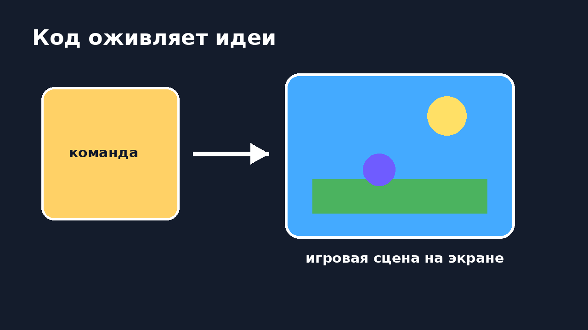
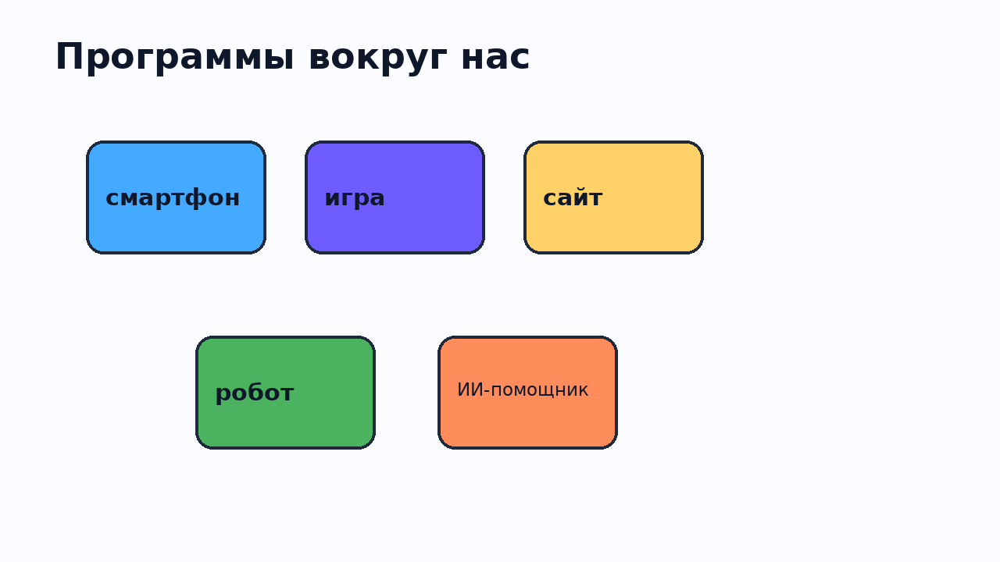
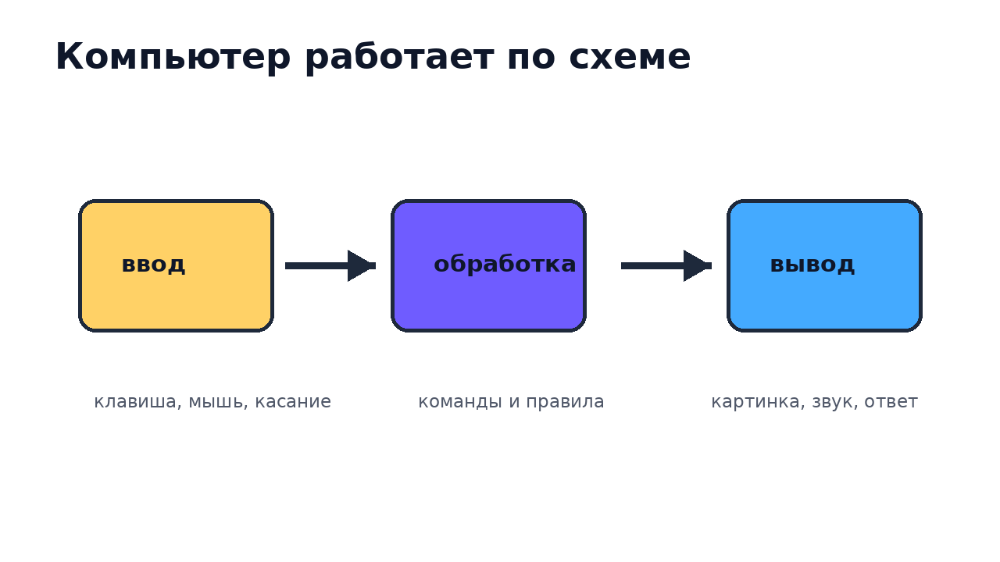
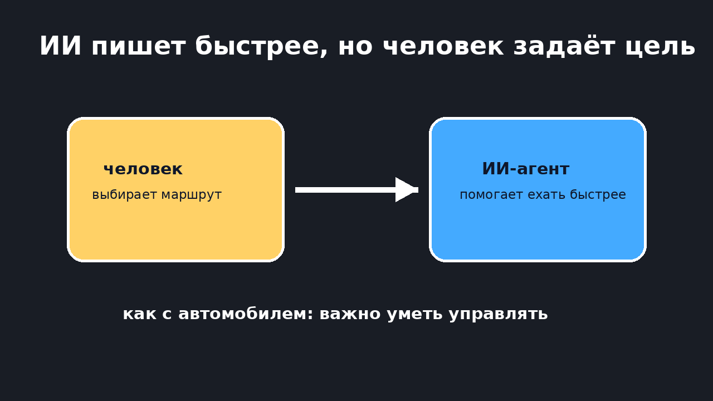
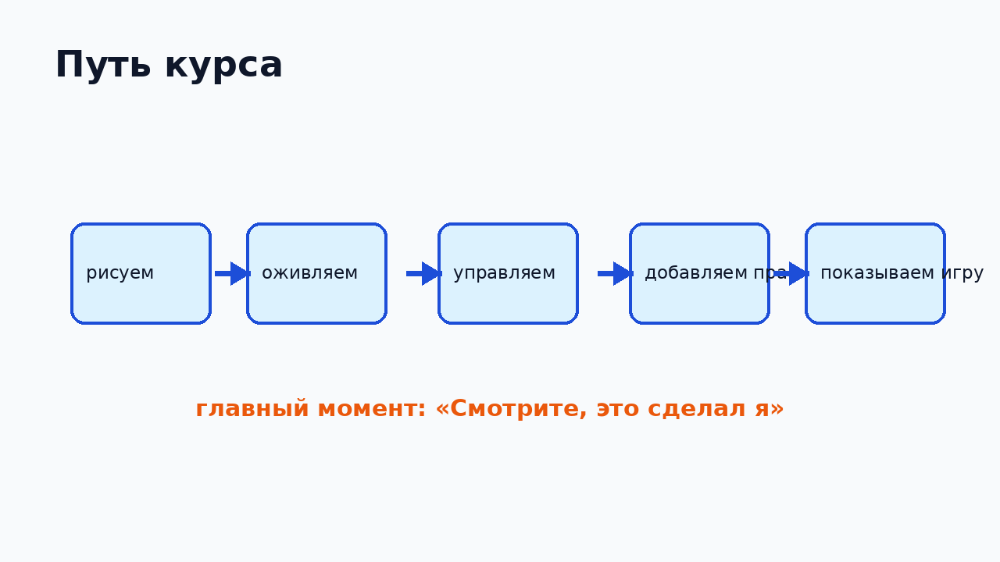

<!-- _class: lead -->

# P0. Как код оживляет игры

Зачем понимать программирование в эпоху ИИ-агентов.

---

# Каждая игра начиналась с команд

Когда-то Minecraft, Roblox, навигатор и ИИ-бот были набором точных инструкций.

Сегодня мы начнём писать такие инструкции сами.

---

# Программы вокруг нас

Смартфон, сайт, игра, робот, умная колонка, ИИ-помощник — всё это программы.

---

# Что делает компьютер

Он получает ввод, выполняет команды и показывает результат.

**ввод → обработка → вывод**

---

# Компьютер быстрый, но буквальный

Не угадывает

Не додумывает

Делает по порядку

Ошибки превращает в подсказки

---

# Программа — это инструкция

сделай окно

нарисуй фон

поставь героя

покажи экран

Похоже на рецепт, только для компьютера.

---

# Зачем нужны языки программирования

Язык программирования помогает говорить с компьютером достаточно точно.

Не «нарисуй красиво», а:

`нарисуй круг в точке (400, 300), радиус 50`

---

# Почему языков много

игры
сайты
роботы
серверы
приложения
ИИ

Как в мастерской: для разных задач нужны разные инструменты.

---

# Почему начинаем с игр

В игре результат видно сразу.

Написал команду — увидел объект на экране.

---

# Ошибки — это не провал

Если вышло странно, компьютер показывает, где мы с ним не договорились.

Иногда странность становится хорошей идеей.

---

# ИИ-агенты уже помогают писать код

Но человек всё равно выбирает цель, проверяет результат и управляет работой.

---

# Метафора с автомобилем

Автомобиль быстрее ходьбы и лошади.

Но водителю всё равно нужно понимать дорогу, правила и управление.

С ИИ так же: он помогает, но направление задаёт человек.

---

# Что будет на курсе

Рисуем → оживляем → управляем → добавляем правила → показываем свою игру.

---

# Сегодня начнём делать

окно

экран

координаты

команды рисования

Это подготовка к первой игровой сцене.

---

# Главная цель курса

У каждого должен быть момент:

**«Смотрите, это сделал я»**

