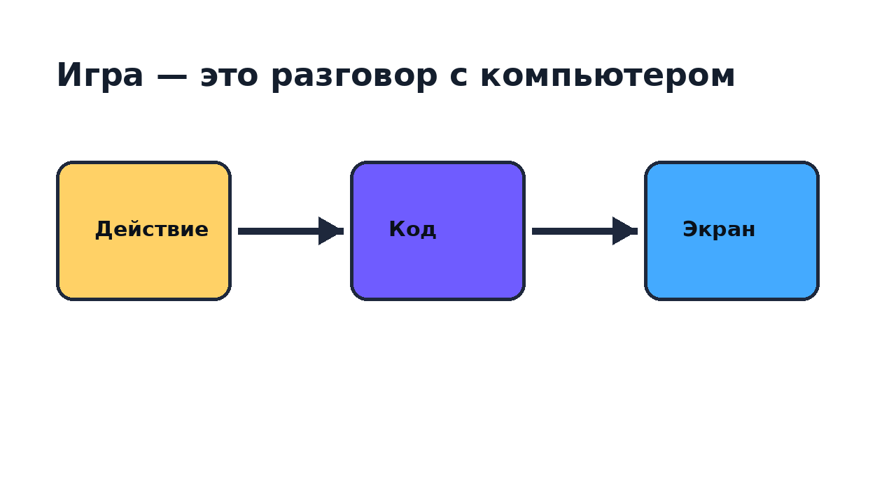

<!-- _class: lead -->

# Урок 1. Экран оживает

Тема занятия: **«Экран оживает»**.

Пишем первую игровую сцену и небольшую покадровую анимацию.

---

# План на сегодня

1. Запустим проект на Python

2. Нарисуем сцену

3. Поймём пиксели, цвет, координаты

4. Исправим первые ошибки

---

# Проект урока

**Обязательная часть**

- окно игры;
- фон;
- 3+ объекта;
- заголовок;
- 3 кадра покадровой анимации.

---

# Где будет ваша часть?

цвета
координаты
секретный объект
забавная ошибка
своя тема
мини-мультфильм

Идеи для выбора: `lessons/lesson1/achivements.md`

---

# Почему программирование важно

Игра — это диалог:

**действие игрока → правила → новый экран**

---

# Компьютер не догадывается

очистить

нарисовать фон

нарисовать героя

показать

Порядок команд — часть результата.

---

# Ошибка дня

Нарисовали героя.

Потом очистили экран.

Герой исчез.

---

# Растр

Экран — сетка маленьких квадратиков.

Квадратик называется **пиксель**.

---

# Цвет как рецепт

RGB:

- R — красный;
- G — зелёный;
- B — синий.

---

# Координаты

`x` идёт вправо.

`y` идёт вниз.

Начало — левый верхний угол.

---

# Вектор

Вектор отвечает:

**куда** и **на сколько** сдвинуться.

---

# Первые команды gamekit

set_window_size
set_fill_color
clear_canvas
draw_circle
draw_rectangle
draw_text
show_canvas

Это наши первые инструменты для рисования.

---

# Числа и арифметика

центр = ширина / 2

земля = высота - 90

звезда = x + 40

Код считает координаты за нас.

---

# Переменные

<b>hero_x</b>
320

Имя помогает не искать число по всему файлу.

---

# Функции

draw_sky()

draw_ground()

draw_hero()

draw_title()

Функция — своя команда.

---

# Если останется время

`if` если нажата кнопка

`while` повторяй кадры

Подробно разберём на следующем уроке.

---

# Практика: готовые примеры

Открываем:

- `lessons/lesson1/samples/01_first_scene.py`
- `lessons/lesson1/samples/02_color_recipes.py`
- `lessons/lesson1/samples/03_coordinate_map.py`
- `lessons/lesson1/samples/04_vectors.py`
- `lessons/lesson1/samples/05_manual_animation.py`

---

# Практика: задания-поломки

Почините:

- `lessons/lesson1/puzzles/01_wrong_order.py`
- `lessons/lesson1/puzzles/02_name_mistake.py`
- `lessons/lesson1/puzzles/03_lost_object.py`
- `lessons/lesson1/puzzles/04_unknown_color.py`
- `lessons/lesson1/puzzles/05_missing_argument.py`

---

# Финальный показ

Покажите сцену и ответьте:

**что вы изменили сами?**

---

# После урока

1. Открой инструкцию: `lessons/lesson1/lesson1_guide.md`.
2. Повтори запуск образца.
3. Выбери 2 достижения.
4. Исправь 1 задание-поломку.
