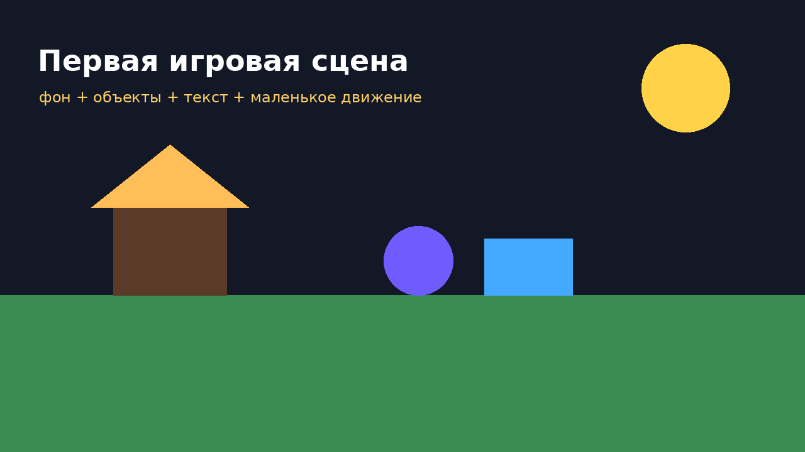
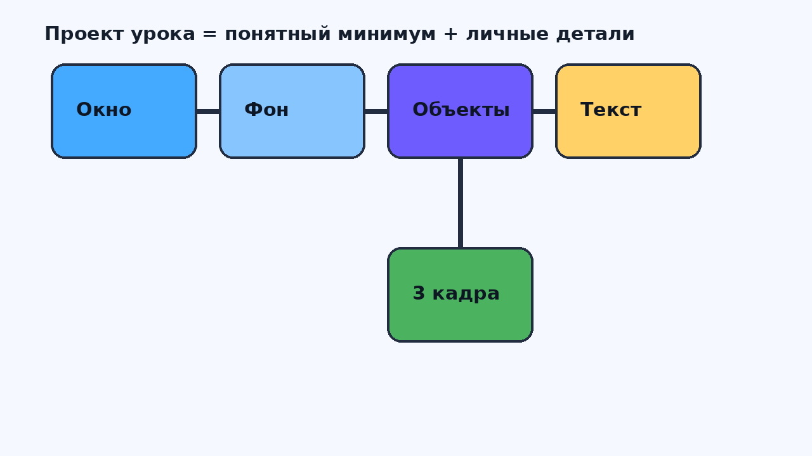
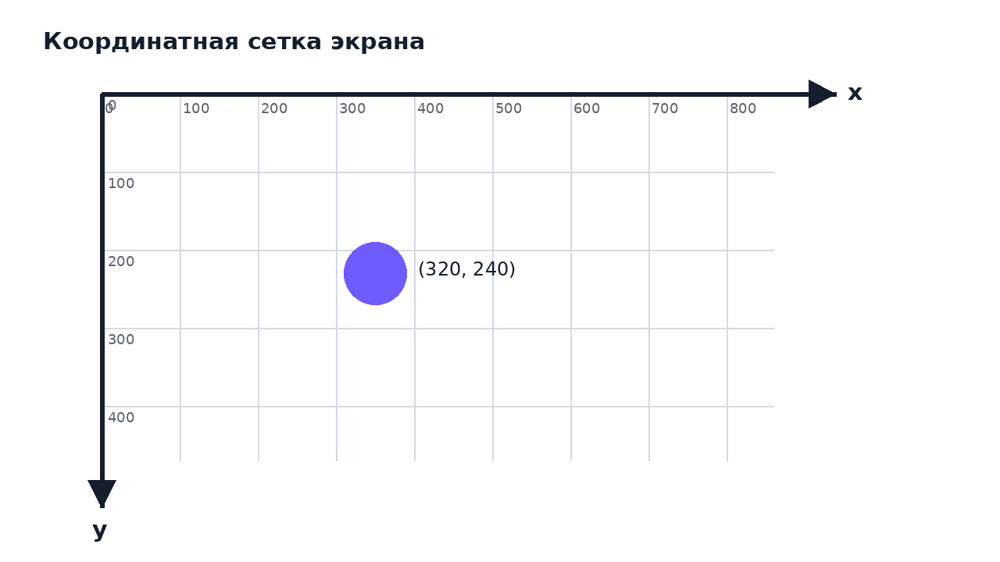
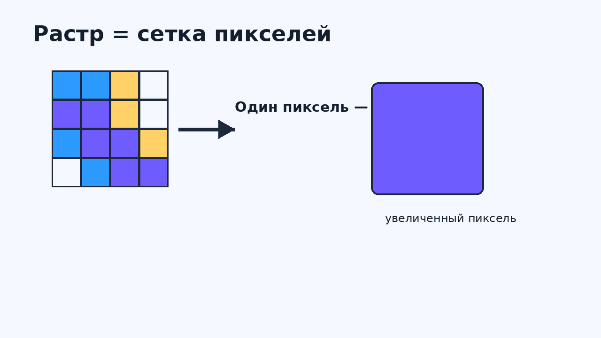
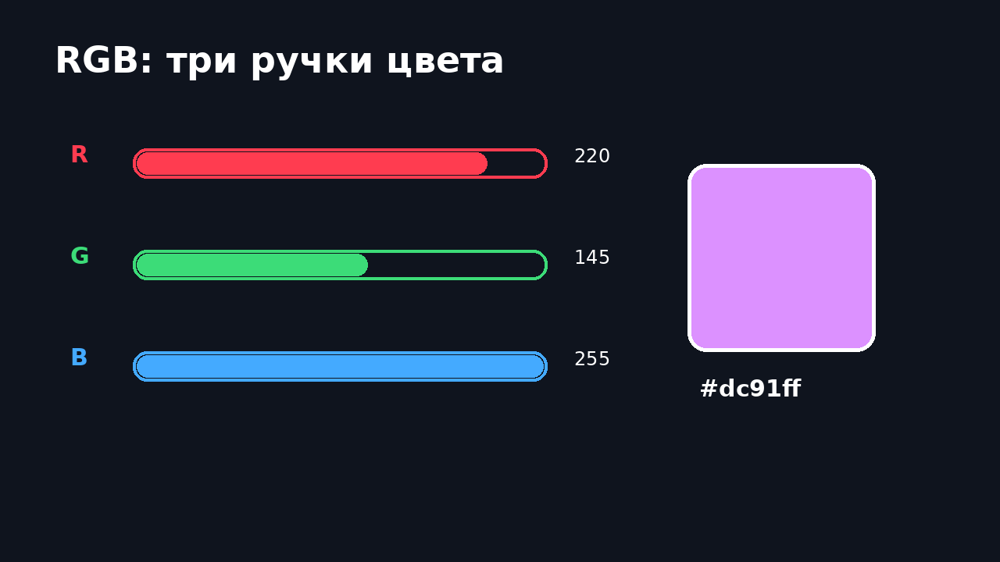
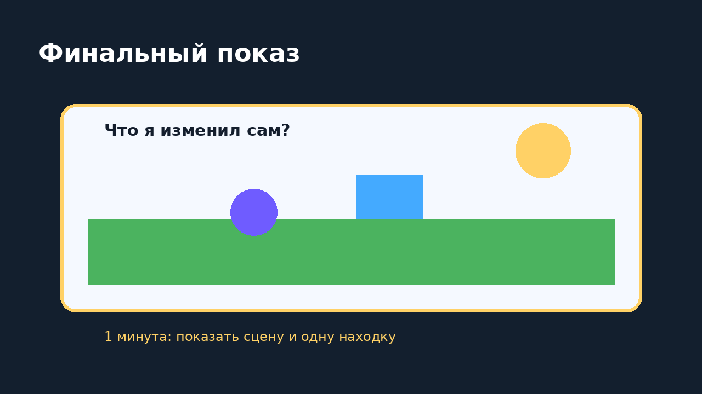
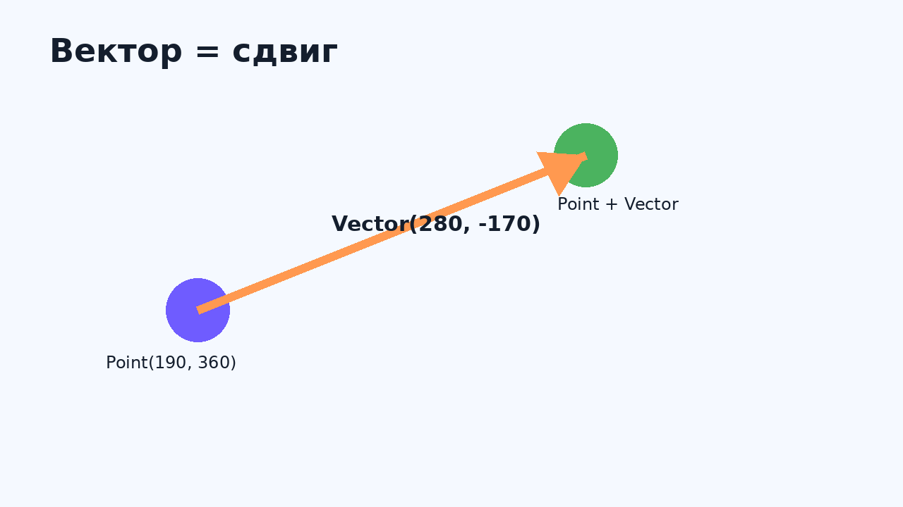
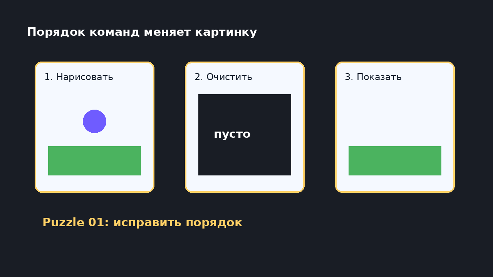

<!-- _class: lead -->

# P1. Рисуем первый игровой мир

Окно, координаты, фигуры, картинки и первые кадры.

---

# Что сделаем сегодня

1. Откроем окно игры

2. Поставим объекты по координатам

3. Проверим порядок рисования

4. Соберём первые кадры движения

---

# С чего начнём

Сегодня мы впервые заставим компьютер нарисовать наш игровой мир.

Поменял число — объект переехал.

Поменял цвет — сцена стала другой.

---

# Окно игры

Окно — это сцена.

В нём живут фон, герои, предметы, эффекты и текст.

---

# Практический результат

окно
фон
герой
цвета
координаты
первые кадры

Идеи для выбора: `lessons/lesson1/achivements.md`

---

# Экран как лист в клетку

Чтобы поставить объект, компьютеру нужен адрес.

Этот адрес — координаты `x` и `y`.

---

# Координаты

`x` — вправо.

`y` — вниз.

Начало — левый верхний угол.

---

# Фигуры — строительные блоки

круг
прямоугольник
линия
картинка
текст
фон

Из простых деталей собирается игровая сцена.

---

# Первые команды gamekit

set_window_size
set_fill_color
clear_canvas
draw_circle
draw_rectangle
draw_text
show_canvas

Это наши первые инструменты для рисования.

---

# Растр

Экран — сетка маленьких квадратиков.

Квадратик называется **пиксель**.

---

# Цвет как рецепт

RGB:

- R — красный;
- G — зелёный;
- B — синий.

Сначала хватит готовых имён цветов.

RGB и HEX — секретный уровень для точной настройки.

---

# Картинки из файлов

В игре можно рисовать не только фигуры.

Герой, монета, фон или значок могут быть обычными картинками из файлов.

---

# Вектор

Вектор отвечает:

**куда** и **на сколько** сдвинуться.

---

# Порядок рисования

нарисовать фон

нарисовать героя

нарисовать текст

показать

Кто нарисован позже — тот сверху.

---

# Ошибка дня

Фон нарисовали после героя.

Фон закрыл героя.

---

# Очистка экрана

очистить

нарисовать новую картинку

показать

подождать

Если не очищать экран, объект оставит след.

Иногда это ошибка. Иногда — интересный эффект.

---

# Первые кадры

кадр 1

кадр 2

кадр 3

движение

Объект не «едет» сам.

Мы быстро показываем несколько картинок подряд.

---

# Зачем нужен sleep

`sleep` делает паузу.

Без паузы кадр промелькнёт слишком быстро.

Сегодня это мультфильм руками.

Настоящий игровой цикл — на следующем занятии.

---

# Практика: готовые примеры

Открываем:

- `lessons/lesson1/samples/01_first_scene.py`
- `lessons/lesson1/samples/02_color_recipes.py`
- `lessons/lesson1/samples/03_coordinate_map.py`
- `lessons/lesson1/samples/04_vectors.py`
- `lessons/lesson1/samples/05_manual_animation.py`
- `lessons/lesson1/samples/06_repeated_object.py`
- `lessons/lesson1/samples/07_example_use_function.py`

---

# Зачем потом понадобятся свои команды

Откройте `06_repeated_object.py`.

Один и тот же робот нарисован несколько раз.

Код повторяется. Позже мы научимся превращать такой повтор в свою команду.

---

# Как выглядит решение

Откройте `07_example_use_function.py`.

Повторяющийся робот спрятан в одну команду:

`draw_robot(120, 210)`

---

# Практика: задания-поломки

Почините:

- `lessons/lesson1/puzzles/01_invisible_scene.py`
- `lessons/lesson1/puzzles/02_python_messages.py`
- `lessons/lesson1/puzzles/03_animation_too_fast.py`
- `lessons/lesson1/puzzles/04_traces_or_bug.py`
- `lessons/lesson1/puzzles/05_background_covers_hero.py`
- `lessons/lesson1/puzzles/06_missing_picture.py`

---

# Финальный показ

Покажите свой мир и ответьте:

**что вы изменили сами?**

---

# После урока

1. Открой инструкцию: `lessons/lesson1/lesson1_guide.md`.
2. Повтори запуск примера.
3. Выбери 2 достижения.
4. Исправь 1 задание-поломку.
